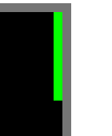

## How to Run

- `git clone` this repo
- `cd` into the directory
- `yarn` or `npm install`
- `yarn run build` or `npm run build`
- `open dist/index.html`

Running `yarn run dev` will start the development mode which will watch files and recompile and won't minify.

## Lessons Learned

### Green and grey tiles next to each other cause optical illusions on a screen with f.lux enabled

In the above image, then f.lux is enabled, it looks like the wall next to the green snake is redish in hue. I was certain this was a rendering bug somewhere. It's not; it's an optical illusion, or a f.lux artifact. The wall is grey.

This is the same image zoomed in, and even with f.lux enabled, the wall is grey. I don't want to admit how much time I wasted on this.

### Determining direction from user input is complex

Snake sounds like a pretty simple game, and it is. The user input is also pretty simple, 4 keys, 4 directions. Snake goes in the direction that was pressed, except it can't go backwards.
While this is true, it's also much simplified view and the complexity becomes apparent when we start thinking about time.
Let's say that one step of our snake game takes 100ms and think about what the user does.

Here is a happy path:
- Snake is moving to the right
- User presses the `up` key at 90ms since the start of the frame
- 10ms later, a new frame starts and snake moves one tile up
- 10 ms later, user presses the `right` key
- 90 ms later, a new frame starts and snake changes direction to the right

So far so good, now let's take a look at a bit unhappier path:
- Snake is moving to the right
- User presses the `up` key 30ms since the start of the frame
- 20ms later, user presses the `right` key
- Snake never changed directions and just kept on moving to the right

In both cases, the user did exactly the same thing, they pressed two keys in rapid succession, 20 ms apart and the snake behaved differently. This makes for a clunky and confusing experience. We cannot have users doing the same actions but having different results.

The solution is to enable queuing up the following direction change even if the current one didn't execute yet. This complicates code a bit but makes for a much better UX.

### Unit Test Movement Logic

Should have done TDD on the movement logic. I managed to, accidentally, break it many. many times. That logic is a perfect candidate for unit testing since it's mostly just pure functions.

## Things to add or improve on

### Map Editor

There is a potential for the map editor here. Maps could be encoded in text, or even simpler, just a set of coordinates where the walls are located. That can be parsed and initialized by the grid module.
I have done something similar in my Pacman game which you can find on my [github](https://github.com/tomca32/).

### Replays

It shouldn't be too difficult to keep a history of the snake's movement. We already keep a previous movement direction on every step in the `input` module; this can be changed to an array and just keep pushing directions into it on every step thus giving us a history of the snake's movement.

### Rendering Optimization

Current rendering code is a nested loop that goes through all the tiles and rerenders them on each frame. This is O(n^2) and can be slow on large maps. Snake is a simple enough game for this to be unnoticeable but it can still be improved.
